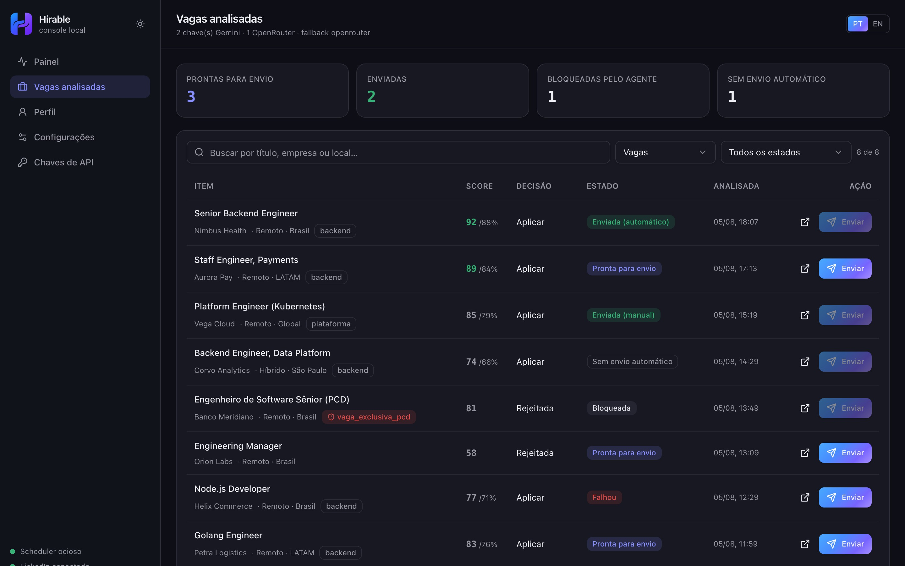
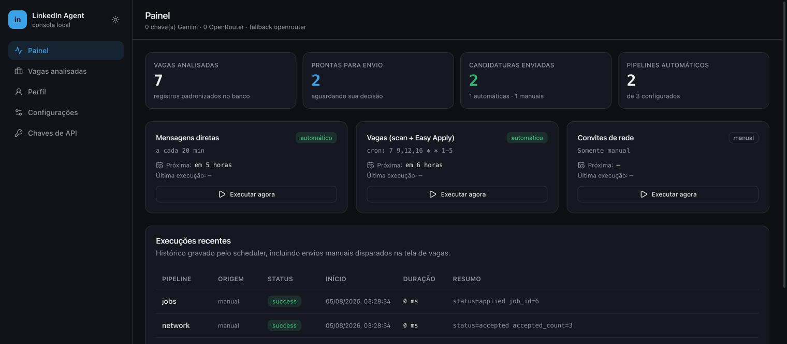
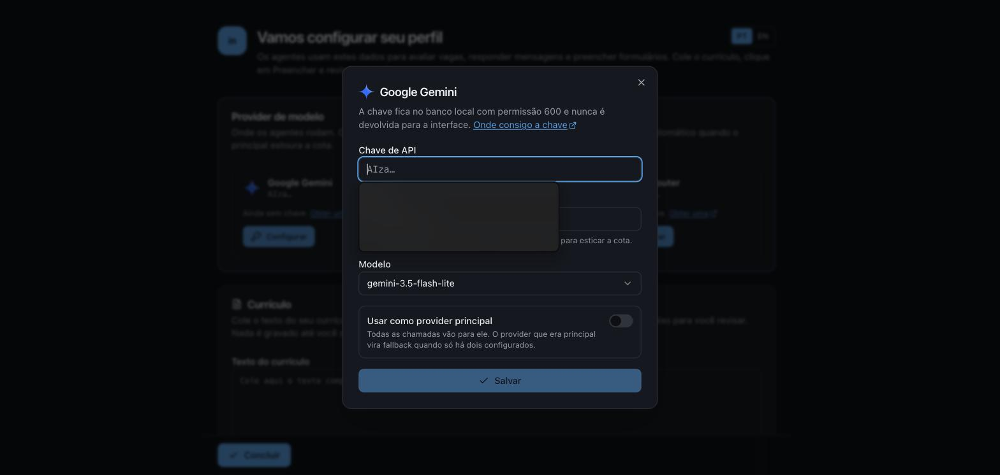
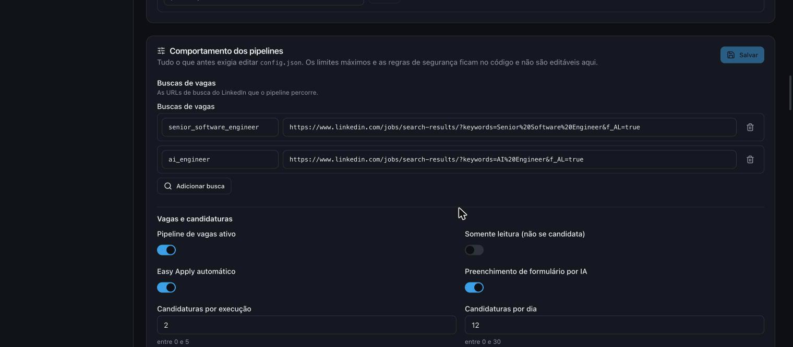

# LinkedIn Local Agent

A local job-search assistant. It scans LinkedIn for openings, evaluates each one against
your profile with an LLM, and submits Easy Apply applications — either on a schedule you
control or one click at a time. It also drafts replies to recruiter DMs and accepts pending
connection invitations.

Everything runs on your machine, against your own browser session and your own API keys.
There is no server, no account, and no data leaves your computer except the calls you make
to the model provider.

<p align="center">
  
</p>

---

## Contents

- [Why it is built this way](#why-it-is-built-this-way)
- [Screens](#screens)
- [Requirements](#requirements)
- [Quick start](#quick-start)
  - [Docker (recommended)](#docker-recommended)
  - [Node (local)](#node-local)
- [First-run setup](#first-run-setup)
- [Configuration](#configuration)
- [Model providers](#model-providers)
- [Résumés](#résumés)
- [Scheduling](#scheduling)
- [Safety model](#safety-model)
- [Architecture](#architecture)
- [CLI reference](#cli-reference)
- [Development](#development)
- [Troubleshooting](#troubleshooting)
- [Disclaimer](#disclaimer)

---

## Why it is built this way

Applying to jobs at scale is easy to get wrong in ways that are expensive and hard to undo:
a bot that answers a disability question on your behalf, applies to a vacancy reserved for a
group you do not belong to, or emails a recruiter before you have reviewed anything.

Three decisions follow from that:

1. **Nothing is declared for you.** Sensitive fields default to *not informed*, and a blank
   field is never read as a "yes".
2. **Nothing sends by default.** Email delivery, automatic scheduling and Easy Apply are all
   opt-in, and each shows exactly why it is currently disabled.
3. **The guard rails are code, not settings.** The list of questions the agent must refuse
   lives in a source file, so widening it requires a diff — not a click.

## Screens

| | |
|---|---|
| **Dashboard** — counters, per-pipeline status and run history | **Analyzed jobs** — every item in one table with a send button |
|  |  |
| **Onboarding** — configure a provider, paste a résumé, an agent fills the profile | **Provider setup** — key, model and role in one dialog |
|  |  |
| **Settings** — Google integration and pipeline behaviour | **Analyzed jobs** — send state per row |
|  |  |

## Requirements

- **Node.js 22.5+** — the app uses the built-in `node:sqlite` module.
- **An API key** for Google Gemini, OpenAI or OpenRouter. A second provider is optional and
  becomes the automatic fallback when the first hits its quota.
- **A LinkedIn account**, logged in once through the app's persistent browser profile.
- Docker, if you prefer the container route.

## Quick start

### Docker (recommended)

```bash
git clone https://github.com/GabrielS4ntos/linkedin-local-agent.git
cd linkedin-local-agent
docker compose up -d
```

Open <http://127.0.0.1:4321>.

The database and the LinkedIn session live in a named volume, so `docker compose pull &&
docker compose up -d` upgrades without losing state. The port is bound to `127.0.0.1` on
purpose — this is a personal console, not a service to expose.

> **One step still needs a real browser:** logging in to LinkedIn. Run
> `npm run dm:check:headed` once on the host (see below) to create the session, or mount an
> existing `.browser-profile` into `/data/browser-profile`. Everything after that runs
> headless inside the container.

### Node (local)

```bash
git clone https://github.com/GabrielS4ntos/linkedin-local-agent.git
cd linkedin-local-agent
npm run setup     # installs deps, Chromium and builds the interface
npm start         # http://127.0.0.1:4321
```

To keep it running in the background on macOS, copy
`launchd/com.example.linkedin-web-console.plist.example` into `~/Library/LaunchAgents/`,
replace `__PROJECT_DIR__` with the absolute path, and `launchctl bootstrap gui/$UID <file>`.

## First-run setup

There are no files to edit. The console walks you through it:

1. **Onboarding, step 1 — profile.** Give your résumé either way: paste the text or upload
   the file. The two are alternatives, so only one is on screen at a time, and the same
   **Preencher** button reads from whichever you chose. An agent extracts your profile —
   contact details, target roles, years per technology, experience, education — using the
   provider's structured-output mode, and fills the form for review. Nothing is saved until
   you confirm, and sensitive fields stay blank unless the résumé states them explicitly.
   The button re-arms only when the source changes: editing the text, or replacing the file
   through **Trocar arquivo**. Re-running over the same résumé costs a model call and returns
   the same fields, so it is not offered. The uploaded file is kept and becomes the first
   résumé the pipelines can use.
2. **Onboarding, step 2 — pipelines.** The schedules, and the résumé library. This step
   exists so the first run ends with you having chosen how often something acts on your
   behalf, rather than discovering it in settings later. Everything here stays editable in
   *Configurações*.

   The onboarding and the profile screen share the same form, so nothing you learn here has
   to be relearned later.
3. **Model provider.** Configure Gemini, OpenAI or OpenRouter right on the onboarding
   screen — the **Preencher** button stays disabled until one is set. The first provider
   becomes the primary; a second becomes its fallback automatically.
4. **Résumé files.** Upload the documents you want attached to emails and selected in Easy
   Apply. Each is summarized once so the agent can pick the right one per job.
5. **Job searches.** Under *Configurações*, paste the LinkedIn search URLs you want scanned
   (open a LinkedIn job search with your filters applied and copy the address bar).
6. **LinkedIn login.** Run `npm run dm:check:headed` once and log in. The session persists
   in `.browser-profile`.
7. **Turn on a schedule.** Pipelines start in *manual*. Switch one to *automatic* when you
   are comfortable with what it is doing.

Optionally, connect Google under *Configurações* to receive alert emails and to have
interview invitations written to your calendar.

## Configuration

Settings resolve in this order, later winning:

| Source | Purpose |
|---|---|
| `src/config-defaults.js` | Defaults in code — a fresh install boots with no files |
| `config.json` | Optional legacy override, imported into the database on first boot |
| Database | What you changed in *Configurações* |
| Environment | Deployment-level overrides |

Environment variables: `AGENT_DATABASE_PATH`, `AGENT_PROFILE_PATH`,
`AGENT_BROWSER_PROFILE_DIR`, `LINKEDIN_HEADLESS`, `GOOGLE_REDIRECT_PORT`, `WEB_HOST`,
`WEB_PORT`.

Two things are deliberately **not** editable through the interface:

- **Guard rails** (`SAFETY`) — the patterns the agent must never answer: visa status,
  salary, race, disability, criminal history, government identifiers. If these were rows the
  web API could write, a bug or a prompt injection reaching a write path could silently
  widen what the automation discloses on your behalf.
- **Hard ceilings** (`HARD_LIMITS`) — a preference may lower an application limit, never
  raise it beyond what protects the account.

The configuration API accepts only paths on an explicit whitelist, validates each value on
its own, and applies the valid ones even when a sibling is rejected.

## Model providers

Three providers are supported — **Google Gemini**, **OpenAI** and **OpenRouter** — each with
its own key, model and role:

| Role | Meaning |
|---|---|
| `primary` | every model call goes here first |
| `fallback` | takes over when the primary fails with a quota or rate error |
| `none` | configured but idle |

Roles settle themselves: the first provider you configure becomes the primary, the second
automatically becomes its fallback, and a third stays idle until you promote it. Gemini
accepts several keys and consumes them round-robin to stretch a free tier.

Keys are stored in the local SQLite file (`chmod 600`). The interface only ever receives a
masked value — never a key — and provider error messages are redacted before display.
Environment variables (`GEMINI_API_KEYS`, `OPENAI_API_KEY`, `OPENROUTER_API_KEY`) remain a
fallback for installs that never used the interface.

## Résumés

Upload your résumé files under **Perfil**. The document itself stays on disk and is what gets
attached to an email or selected in the Easy Apply form.

Choosing which résumé fits a job is the interesting part. The obvious approach — sending the
full text of every résumé with every job evaluation — costs N résumés × M jobs × thousands of
tokens on every scan. Instead:

1. **Once per upload**, one model call summarizes the file into a compact index: headline,
   roles, technologies, seniority. `.docx`, `.txt`, `.md` and `.rtf` are read automatically
   (no third-party parser: a `.docx` is a ZIP, and only `word/document.xml` is needed). A
   `.pdf` is stored and attached, but you describe it in the label.
2. **Per job**, matching is keyword affinity against that index — no model call at all.
3. The job evaluator, which already runs per job, additionally receives the one-line
   summaries (~30 tokens each) and may name a résumé; when it does, its choice wins, because
   it read the full description.

A tie, or no signal, falls back to the résumé marked as default, so the choice is predictable
rather than arbitrary.

## Scheduling

Each pipeline (`dm`, `network`, `jobs`) is independently configured:

- **Mode** — `automatic`, `manual` (runs only when you click) or `off`.
- **Schedule** — a cron expression you write, a fixed interval, or a list of daily times.
- **Window** — allowed weekdays and an hour range applied on top, so a frequent cron still
  never fires at 3am.
- **Jitter** — a random delay before each automatic run.

Cron supports the standard five fields with ranges, lists, `*/steps`, month and weekday
names, and `@daily`-style presets. The settings screen validates as you type and previews
the next five executions.

The scheduler runs inside `npm start`. It ticks every 30 seconds and executes **one pipeline
at a time**, because they share a single Chromium profile. Every execution is recorded in
`pipeline_runs` and shown on the dashboard.

**Pipelines stay disarmed until your profile is complete.** Automatic mode cannot be
selected, "Run now" and the manual "Send" button are disabled, no next run is scheduled, and
a direct CLI invocation exits with `status: "skipped"`, `code: "profile_incomplete"`. The
agents treat the profile as their only trusted source of facts about you, so running without
it would mean acting on guesses. Fill the required fields on the profile screen and the
schedules re-arm on the next tick.

## Safety model

**Standardized records.** Jobs, DMs and invitations are normalized into one shape and share
a single table. `send_state` drives the button:

| State | Button | Meaning |
|---|---|---|
| `available` | enabled | analyzed and ready for a manual send |
| `failed` | enabled | a previous attempt failed; retry allowed |
| `in_progress` | disabled | a send is running right now |
| `sent_auto` | disabled | already applied by the automatic pipeline |
| `sent_manual` | disabled | already applied from the interface |
| `unsupported` | disabled | no automatic send method (no Easy Apply) |
| `blocked` | disabled | the agent or the safety rules refuse the send |

Hovering a disabled button shows the exact reason. A rescan never downgrades a record that
was already sent, so an application cannot be submitted twice.

**No résumé, no application.** Easy Apply and the job digest both put a document in front of a
recruiter, so both refuse to run while the database holds none — otherwise the only options
would be submitting whatever LinkedIn happened to have preselected, or emailing an alert that
promises an attachment it cannot produce. Scanning and evaluating stay available: they send
nothing.

At the résumé step the agent expands the full list, looks for the chosen document among the
entries LinkedIn already has, and selects it. Only when it genuinely is not there does it
upload the stored file — LinkedIn caps how many résumés an account keeps, so uploading on
every application would pile up duplicates; the upload is a first-use bootstrap, not a routine
step. Matching tolerates the name being truncated by the interface but never accepts a short
prefix standing in for a longer name, because "CV" matching "CV_antigo_2019" is how the wrong
document gets submitted. The selection is verified afterwards, and an unverified one is
reported rather than assumed.

**Restricted vacancies.** A résumé cannot be trusted to state whether you belong to an
affirmative-action group. A deterministic guard blocks any vacancy exclusive to a group your
profile does not explicitly declare — silence is never a yes — and the same gate runs on the
manual send, so a click cannot bypass it. Ordinary diversity boilerplate does not block
anything: a restriction is only detected when a group term appears next to an exclusivity
marker.

**Untrusted content.** Job descriptions, form labels and résumé text are passed to models as
data inside tagged blocks, never as instructions. Prompt-injection patterns are rejected
before any field is filled.

**Secrets.** API keys and OAuth tokens are stored in a `chmod 600` SQLite file. The
interface only ever receives masked values and presence flags — never a key, a client secret
or a token. Provider error messages are redacted before being displayed.

**Email.** Delivery stays off until an account is connected, a recipient is saved and you
explicitly enable it. Disconnecting the account turns it back off.

## Alerts and auto-fix

**One failure, one email.** Alerts are grouped by a fingerprint of *what broke* — command,
status and a normalized message with ids, paths, timestamps and numbers removed — so the same
failure about thirty different jobs is one group. The first occurrence is delivered; repeats
inside the silence window (default 2h, configurable, `0` disables grouping) are counted but
stay silent, and the suppressed count rides along on the next email that goes out. Nothing is
lost: every occurrence is still written to `logs/alerts.jsonl` and to the `alert_events` table.

Emails are HTML with a plain-text alternative, showing the failure, how many times it has
happened, and the auto-fix outcome when it ran.

**Auto-fix** is off by default. When enabled, a failure is also handed to a coding-agent CLI —
Claude Code, Codex, opencode or Agy — which investigates, fixes, runs `npm test` and restarts
the service itself. Agents use the same role model as the model providers: the first one
enabled becomes primary, the second its fallback, tried in order when the primary fails or is
not installed.

The agent runs in a sandbox built from three layers:

| Layer | What it does |
|---|---|
| Restricted `PATH` | The process starts with a generated bin directory containing symlinks to an allowlist only: read-only inspection (`cat`, `grep`, `find`, `sed`…), `node`/`npm`/`npx`, and the agent's own binary. `git`, `curl`, `rm`, `sudo`, `docker` and everything else simply do not exist for it. |
| CLI permission flags | Each agent is also launched with its own deny flags, as a second opinion. |
| The instruction | States the boundaries in words, and frames the error text as untrusted data. |

The first layer is what holds when the other two are ignored. This app's secrets are stripped
from the agent's environment; the agent's own credentials are preserved so it can authenticate.

**Prompt injection.** The failure message can contain a LinkedIn page title or a model
response — text nobody on your side wrote. It is sanitized (backticks and control characters
removed, length capped), quoted inside explicit `<<<ERRO_INICIO>>>`/`<<<ERRO_FIM>>>` markers it
cannot close, and preceded by an instruction to treat everything inside as data and to report
any attempt to issue orders from within it.

**Restart.** The agent restarts through exactly one path, `npm run service:restart`, which asks
the running server to exit so the supervisor starts it again. It only works when something is
actually supervising the process — Docker's `restart: unless-stopped`, launchd's `KeepAlive`,
or `AGENT_SUPERVISED=1` — and refuses otherwise, because exiting unsupervised would stop the
service instead of restarting it. Changes are left in the working tree: the agent has no git.

## Architecture

```
src/
  cli.js               pipelines: dm:check, network:accept, jobs:scan, jobs:apply-one
  config.js            resolves defaults ← config.json ← database ← environment
  config-defaults.js   defaults, safety rails, hard limits, editable whitelist
  profile-schema.js    the profile contract: UI, extraction prompt and agents
  agent-record.js      one canonical record shape for every pipeline
  job-eligibility.js   deterministic guard for restricted vacancies
  cron.js              5-field cron parser and next-run resolver
  scheduler.js         queue and executor, one pipeline at a time
  semantic-memory.js   embedding-backed memory of previous form answers
  app-store.js         SQLite: keys, schedules, runs, records, profile, settings
  web/server.js        JSON API + static hosting, bound to loopback
web/                   React + Vite + Tailwind + shadcn/ui console
```

One SQLite file holds everything. The CLI and the web server are separate processes over the
same database, which is why a pipeline can be started from the interface, from a terminal, or
from a scheduler without any coordination beyond a run lock.

## CLI reference

Every pipeline is runnable directly, which is useful for debugging:

```bash
npm start                       # web console + scheduler
npm run dm:check                # read the inbox, draft and send replies
npm run dm:check:headed         # same, with a visible browser (use this to log in)
npm run network:accept          # accept pending invitations
npm run jobs:scan               # scan, evaluate and apply within the limits
npm run jobs:apply-one -- <id>  # apply to a single record
npm run profile:extract < cv.txt   # profile extraction, prints JSON
npm run auth:status             # keys and Google token status
npm run storage:status          # database summary
npm run validate                # configuration sanity check
npm test                        # unit tests
```

`npm run jobs:form-smoke -- <url>` opens exactly one Easy Apply form with
`LINKEDIN_STOP_BEFORE_SUBMIT=true`; it can never submit and exists to validate selectors.

## Development

```bash
npm run web        # API on :4321
npm run web:dev    # Vite dev server on :4322, proxies /api
npm test
```

Local data — `config.json`, `profile.json`, `data/`, `secrets/`, `.browser-profile/`, logs
and machine-specific launchd files — is gitignored. Never commit API keys, tokens or résumés.

## Troubleshooting

**"Perfil incompleto"** — complete the onboarding, or keep a valid `profile.json`.

**"Nenhuma chave Gemini cadastrada"** — add a key under *Chaves de API*, or export
`GEMINI_API_KEYS` in `secrets/.env`.

**A pipeline reports `needs_login`** — the LinkedIn session expired. Run
`npm run dm:check:headed` and log in again.

**A schedule shows `schedule_error`** — the expression never matches the allowed window or
weekdays. The settings screen previews the next executions; an empty preview means the same.

**Automatic mode does nothing** — the scheduler lives inside the web server. It must stay
running (`npm start`, `docker compose up -d`, or the launchd agent).

**Chromium crashes in Docker** — increase `shm_size` in `compose.yaml`.

## Disclaimer

This project automates a logged-in LinkedIn session. That is against LinkedIn's User
Agreement, and using it puts your account at risk. The defaults are conservative — low
application ceilings, jitter between actions, one browser at a time — but the risk does not
go to zero. Use it on an account you can afford to lose, and read what it is about to do
before turning any pipeline to automatic.

The agent submits real applications to real companies on your behalf. Review the analyzed
jobs before enabling automatic Easy Apply.
